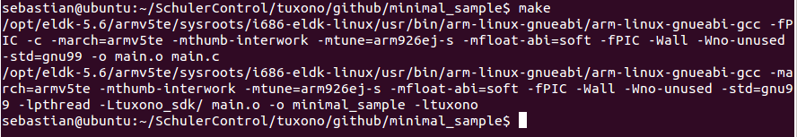
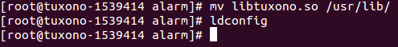
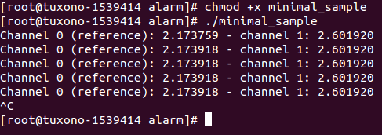

##Tuxono SDK - Minimal sample
Clone this repository to get started.
>```
$ git clone https://github.com/SchulerControl/minimal_sample.git
```

Further you will need the Tuxono SDK. The easiest way to use it, is to clone its repository **into** your minimal sample directory.
>```
$ git clone https://github.com/SchulerControl/tuxono_sdk.git
```

To compile the minimal sample you will further need a cross-compiler for ARM. 
To setup a cross-compiler you can follow the steps described in the [wiki section 'Download and setup a cross-compiler'](https://github.com/SchulerControl/documentation/wiki/1.-Setup-your-host-system#download-and-setup-a-cross-compiler) or run your own.

Now type into the terminal
>```
$ make
```
and you should see something like this


###Deploy Tuxono SDK shared library
Before we can run our application we need to have deployed the Tuxono SDK shared library on the correct location on the device. Start by opening a SSH session to the device with the user 'alarm'.
The password for user 'alarm' is also 'alarm'. Copy the 'libtuxono.so' from the Tuxono SDK folder onto the device (for example with Filezilla or scp).

Now you have to gain root access rights. Do so by typing the command
>```
$ su root
```
The password for user 'root' is also 'root'. Now move the library to '/usr/lib/' and run 'ldconfig'.


###Run the minimal sample application
Copy the application to the device, set the execution access rights and run it with root access. You should see something like this and the LEDs marked 'live' and '6' should blink alternatingly.

